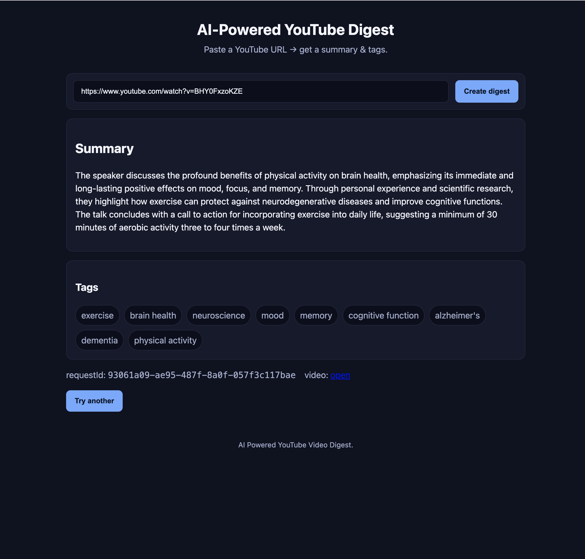

# AI YouTube Digest 🤖

**AI YouTube Digest** is a learning project where I explored how to integrate an AI model into a real application, while also experimenting with a **microservices architecture** in Kotlin and Spring Boot.  

The app takes a **YouTube URL**, extracts its transcript, and generates a **short summary with tags** using an LLM.  

<p align="center">
  
</p>

---

## 🚀 Features
- Paste a YouTube link → get an AI-generated **summary + tags**.
- Built with **Spring Boot + Kotlin**.
- Event-driven **microservices** with **Kafka** as the backbone.
- **Spring Cloud Functions** to process Kafka events.
- **MongoDB** to store digests.
- Simple **client web app** served with NGINX.

---

## 🧩 Architecture

The system is composed of multiple services orchestrated with **Docker Compose**:

- **Ingestion Service**  
  Accepts YouTube URLs, downloads subtitles using `yt-dlp`, and publishes transcripts to Kafka.

- **AI Processor Service**  
  Listens for transcript events, calls an AI model (OpenAI API) to generate a digest (summary + tags), then emits a result event.

- **Result Service**  
  Consumes digest events, saves them in MongoDB, and exposes REST endpoints for clients.

- **Client App**  
  A lightweight web frontend (HTML/CSS/JS) that communicates with the services through an NGINX reverse proxy.

<p align="center">
  
</p>

---

## ⚙️ Tech Stack
- **Language**: Kotlin  
- **Frameworks**: Spring Boot, Spring Cloud Function  
- **Messaging**: Apache Kafka  
- **Database**: MongoDB  
- **AI**: OpenAI API (LLM for summarization)  
- **Frontend**: Vanilla JS + HTML/CSS  
- **Infra**: Docker, Docker Compose, NGINX  

---

## 🛠️ Getting Started

### 1. Clone the repo

```bash
git clone https://github.com/mlrdevs97/ai-ytb-digest.git
cd ai-ytb-digest

### 2. Set environment variables

Copy the example file and add your OpenAI API key:

cp .env.example .env


Edit .env and set:

OPENAI_API_KEY=sk-xxxxxx

### 3. Run with Docker Compose
docker compose up --build

### 4. Open the client

Go to http://localhost:8888
, paste a YouTube link, and wait for the digest
